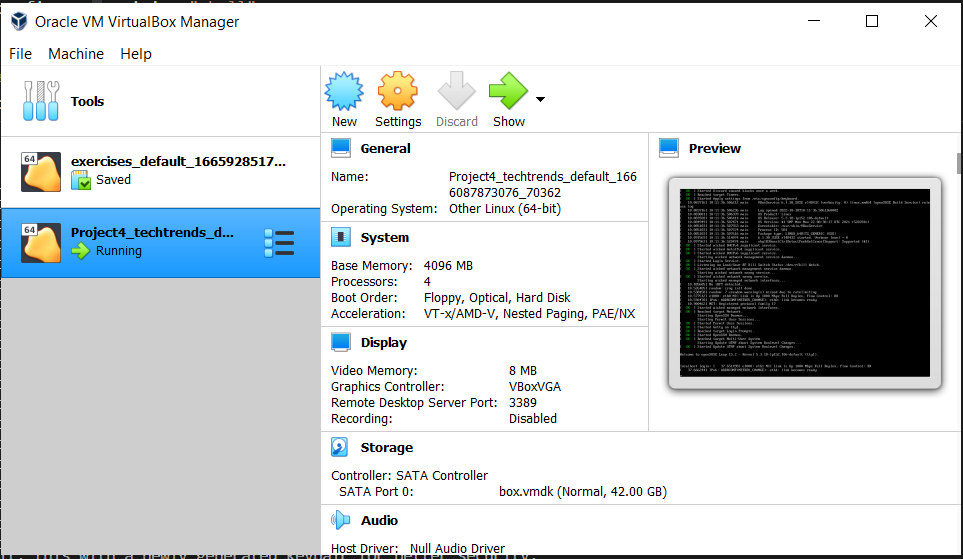

## Techtrends project 

Step 1: Creating the docker images and taging it: Docker for Application Packaging 
### Docker contents here 


Step 2: Github actions: Continuous Integration with Github Actions
        1. Create a new repo
        2. push your codes to the new repo
        3. Add the docker token and GitHub encrypted secrets from the project directory Goto `settings` > `secret` > `Actions` > click `New repository secret`
        4. create the `techtrends-dockerhub.yml` in the `.github/workflows/` Might be created automatically when creating the github action.
        5. Goto `Github Actions` and click on the `create a new workflow yourself` button


Step 3: Kubernetetes Declarative Manifests 

## Deploy a Kubernetes cluster

Make sure your oracle VM Box is open

# create a vagrant box using the Vagrantfile in the current directory
`vagrant up`



# SSH into the vagrant box
# Note: this command uses the .vagrant folder to identify the details of the vagrant box, you can ls to make sure it is included
`vagrant ssh`

# Deploy the Kubernetes cluster from the k3s documentation 

`curl -sfL https://get.k3s.io | sh - `

# Give yourself the root access to kubeconfig 

`sudo su`

## Get all nodes 

`kubectl get no`

## create your Kubernetes Declarative Manifests file namespace.yaml, deploy.yaml and service.yaml

1. make a new file called namespace.yaml and vim into it to add your files 
2. run below codes 

```
touch namespace.yaml
touch deploy.yaml
touch service.yaml
```

```

kubectl apply -f namespace.yaml
kubectl apply -f deploy.yaml
kubectl apply -f service.yaml

```


Get all Kubectl namespace 

`` kubectl get all -n sandbox ``

Step 4: Helm Charts
