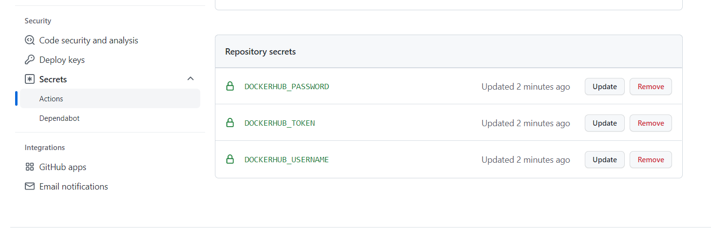

### Techtrends project 

Step 1: Creating the docker images and taging it: Docker for Application Packaging 
## Docker contents here 

Step 2: Github actions: Continuous Integration with Github Actions
        1. Create a new repo
        2. push your codes to the new repo
        3. Add the docker token and GitHub encrypted secrets from the project directory Goto `settings` > `secret` > `Actions` > click `New repository secret`
        4. create the `techtrends-dockerhub.yml` in the `.github/workflows/` Might be created automatically when creating the github action.
        5. Goto `Github Actions` and click on the `create a new workflow yourself` button

Step 3: Kubernetetes Declarative Manifests 

